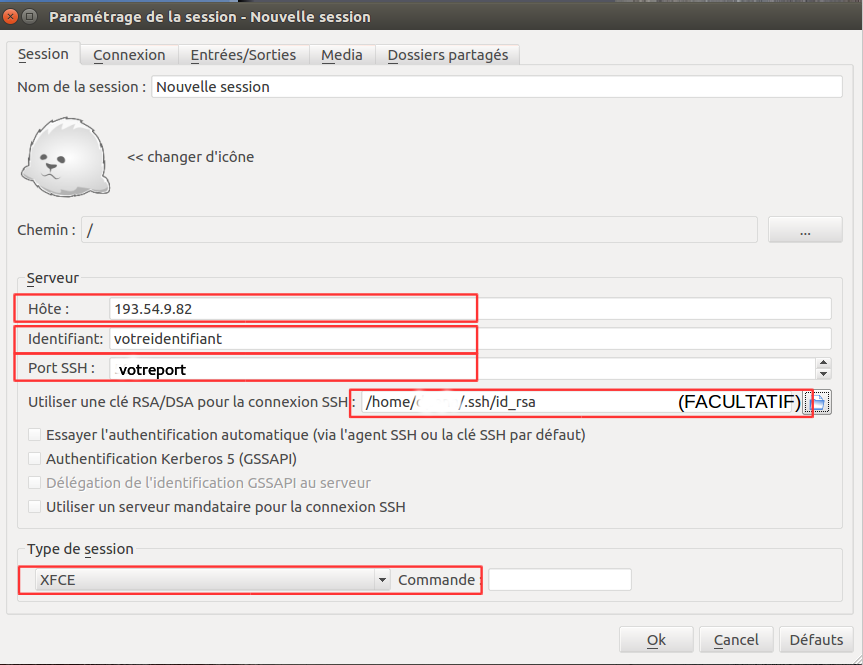
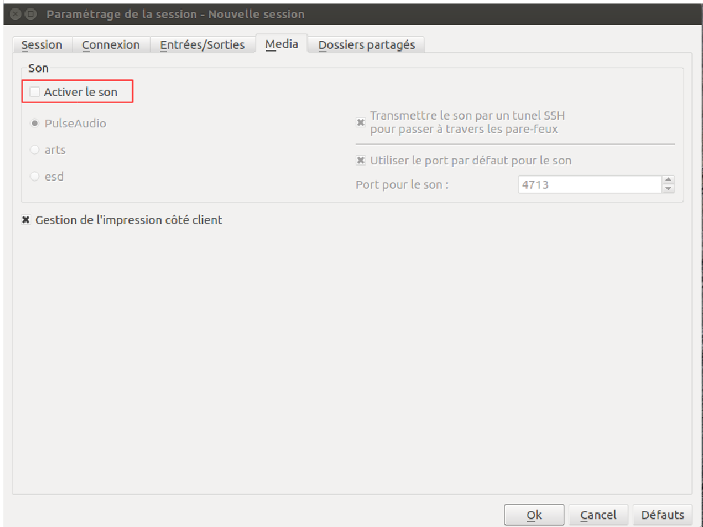
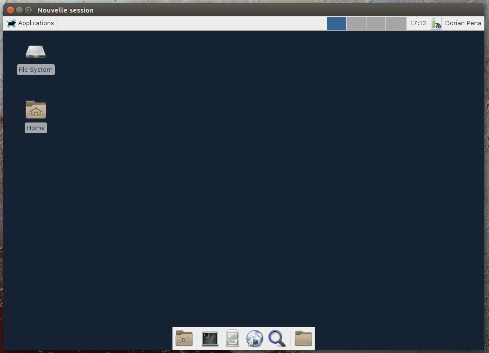

La connexion à votre environnement EXPLOR en mode graphique nécessite le client X2GO.
Ce programme est compatible windows, mac os et linux.

Vous pouvez télécharger le client X2GO sur la page suivante : [http://wiki.x2go.org/doku.php/download:start](http://wiki.x2go.org/doku.php/download:start) ou dans les dépôts de la plupart des distributions linux.

#Configuration de X2GO

Dans "Session" :

* "Hôte" : 193.54.9.82

* "Identifiant" : votre_identifiant

* "Port" : votre_port_de_connexion

* (Facultatif) Sélectionner voter clé privée

* "Type de session" : XFCE

Dans "Media" :

* Décochez la prise en charge du son
 

* Cliquer sur OK puis connectez-vous à la session
 

Vous voici sur votre bureau personnel EXPLOR !

# Se déconnecter de votre session X2GO

!!! note ""
    Pour vous déconnecter, il suffit simplement de fermer la fenêtre de votre session X2GO. Vos fenêtres et applications ouvertes seront conservées jusqu'à la prochaine connexion.

!!! warning ""
    Afin de limiter les ressources systèmes pouvant entraîner des ralentissements dans votre environnement de travail partagé, nous vous demandons d'utiliser avec parcimonie les applications lourdes en ressources systèmes telles que firefox et de fermer celles-ci avant de vous déconnecter de votre session.

