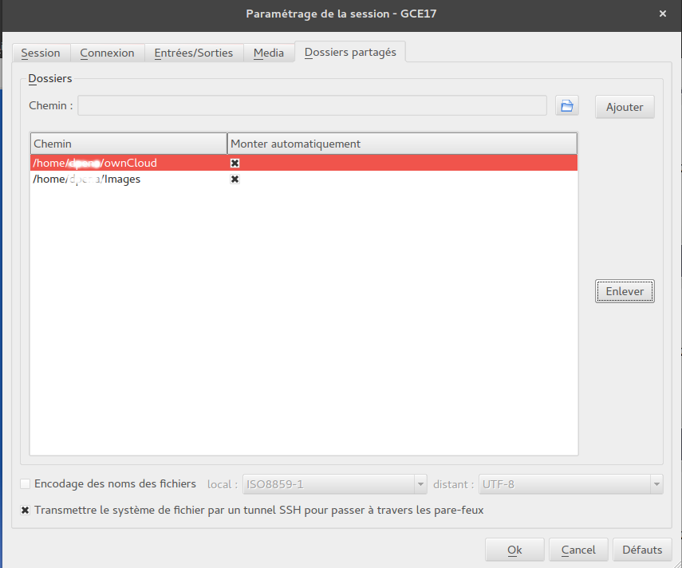
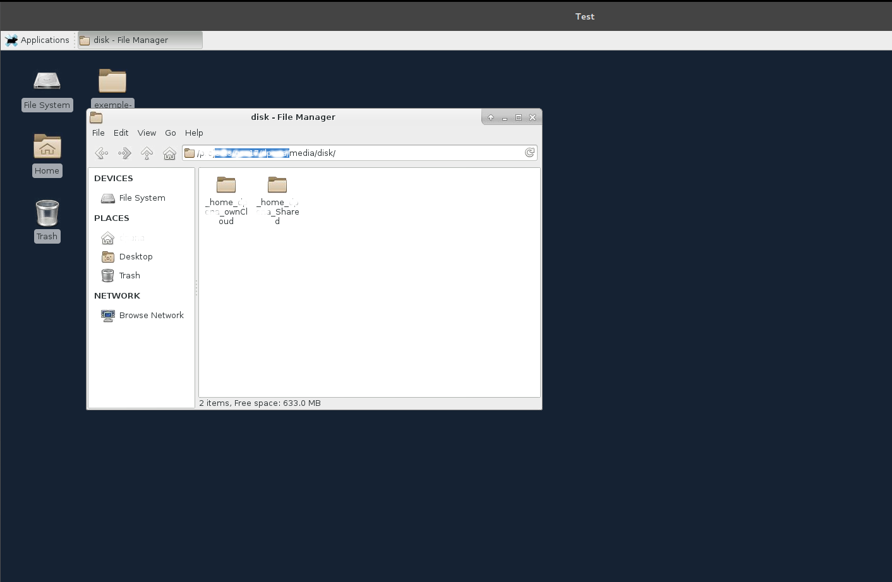

# Transferts de fichiers

## Copie de fichiers via la commande scp

* Pour copier un dossier depuis votre poste de travail sur le répertoire courant de votre environnement de travail EXPLOR  si vous avez procédé à la [création d'un alias ssh](console.md) :

	```
	$ scp -r <dossier> meso-explor:
	```

* Sinon :


	```
	$ scp -r -P xxxx  <dossier> votre_identifiant@193.54.9.82:
	```

**xxxx** étant votre port de connexion

## Synchronisation d'un dossier via la commande rsync

* Pour synchroniser un dossier depuis votre poste de travail sur le répertoire courant de votre environnement de travail EXPLOR :

	```
	$ rsync -avzre "ssh -p xxxx" <dossier> votre_identifiant@193.54.9.82:
	```

**xxxx** étant votre port de connexion

## Partage de dossier avec X2GO

**[X2GO](graphique.md)** permet le partage en lecture/écriture d'un répertoire de votre poste de travail personnel sur votre environnement de travail EXPLOR.
Pour activer cette fonctionnalité veuillez suivre les instructions ci-dessous :

* Dans "Dossier Partagés", ajouter les dossiers que vous souhaitez partager et cocher les options (Monter automatiquement, Tunnel SSH...) comme ci-dessous :



* À la prochaine connexion, les dossiers partagés sont accessibles dans $HOMEDIR/media/disk



!!! warning ""
    Un bug courant de X2GO est de ne pouvoir partager les répertoires contenant des accents ou caractères non conventionnels.

!!! note ""
	Il n'est pas autorisé de soumettre des jobs slurm depuis un dossier partagé


